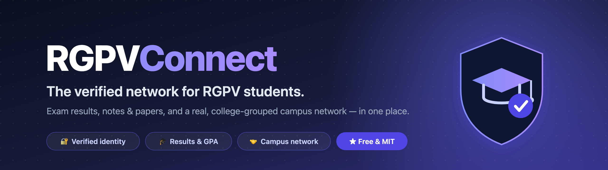
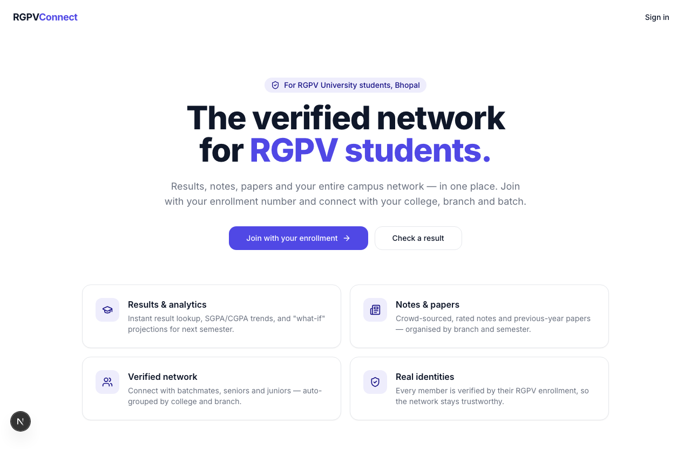
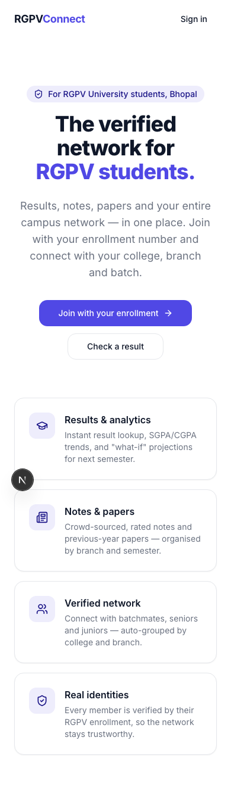
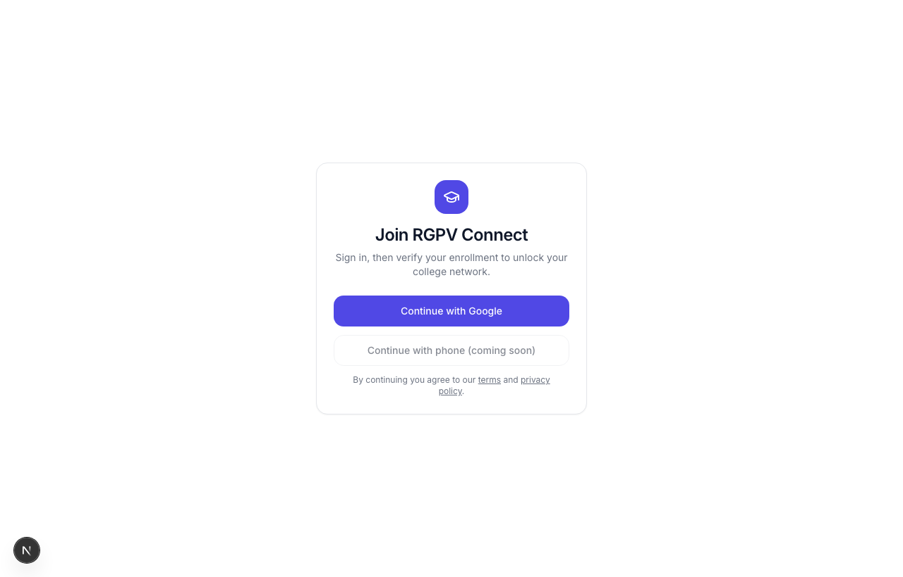
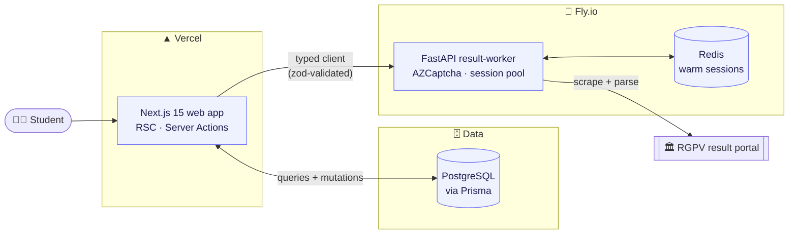

<a id="top"></a>
<!-- PROJECT HERO -->
<div align="center">



<br/>
<br/>

**The free, open-source, verified student network & utility platform for [RGPV University, Bhopal](https://www.rgpv.ac.in/).**

_Exam results, notes & papers, and a real, college-grouped campus network — built by students, for students._

<br/>

<!-- STATUS BADGES -->
[](LICENSE)
[](CONTRIBUTING.md)
[](https://github.com/vishalmeena2211/rgpv-connect-platform/issues?q=is%3Aissue+is%3Aopen+label%3A%22good+first+issue%22)
[](https://github.com/vishalmeena2211/rgpv-connect-platform/commits/main)
[](https://github.com/vishalmeena2211/rgpv-connect-platform/stargazers)

<!-- BUILT WITH -->


<br/>

[**✨ Features**](#-features) · [**🖼️ Screenshots**](#️-screenshots) · [**🚀 Quick start**](#-quick-start) · [**🗺️ Architecture**](#️-architecture) · [**🧭 Roadmap**](#-roadmap) · [**🤝 Contributing**](#-contributing)

</div>

---

## 💡 Why RGPV Connect?

A WhatsApp group has 200 unverified people. RGPV Connect has 200 people **cryptographically bound to a real RGPV enrollment number** — and that single property is what a chat app can never reproduce.

It started as a plain results-lookup site. This monorepo is the community rewrite: the utilities everyone already needs (results, notes, papers) become the front door, and a **verified, auto-grouped student network** sits on top.

- 🎓 **Check results faster than the official portal** — with SGPA/CGPA trends and "what-if" projections.
- 🔐 **Every profile is verified** by enrollment number, then auto-grouped into your college, branch & batch. No self-reported fakes.
- 📚 **Crowd-sourced notes & papers**, organised by branch and semester.
- 🤝 **Find your batchmates, seniors and juniors** — a real campus directory, not a 900-person group chat.
- 🆓 **Free forever, MIT-licensed.** No paywalls, no premium tier, no ads. Anyone can run it, audit it, or improve it.

<div align="right"><a href="#top">↑ back to top</a></div>

## 🖼️ Screenshots

<div align="center">
<table>
  <tr>
    <td width="66%"></td>
    <td width="34%"></td>
  </tr>
  <tr>
    <td align="center"><em>Landing — desktop</em></td>
    <td align="center"><em>Mobile (PWA-ready)</em></td>
  </tr>
</table>



<em>Sign in, then verify your enrollment to unlock your college network</em>
</div>

<div align="right"><a href="#top">↑ back to top</a></div>

## ✨ Features

RGPV Connect is built in **three layers** — utilities pull students in, the network keeps them, and the campus layer makes it useful.

### 🎓 Layer 1 — Utility

| Feature | What it does |
| --- | --- |
| **Result lookup** | Punch in any enrollment number, get the semester result instantly — no signup needed to view. |
| **My Results** | Auto-synced result history across semesters, tied to your verified account. |
| **SGPA / CGPA calculator** | Compute grades and run "what-if" projections for next semester. |
| **Notes & papers** | Crowd-sourced, rated, and organised by branch → semester → subject. |

### 🤝 Layer 2 — Network

| Feature | What it does |
| --- | --- |
| **Verified profiles** | Auto-grouped by college, branch & batch from your enrollment number. |
| **Directory & follows** | Find and follow batchmates, seniors and juniors. |
| **Feed & groups** | College-scoped posts; auto-created branch + semester cohorts. |
| **Direct messages** | 1:1 conversations with read receipts. |

### 🧭 Layer 3 — Opportunities & Campus

| Feature | What it does |
| --- | --- |
| **Jobs & internships** | Verified-only postings, filterable by branch & year. |
| **Campus marketplace** | Buy-sell used books, prep material & more — trusted because everyone's verified. |

> **All of it is free.** There is no premium gate, take-rate, or paid tier anywhere in the codebase.

<div align="right"><a href="#top">↑ back to top</a></div>

## 🔐 How verification works

Most RGPV-affiliated colleges don't issue institutional email, so we can't rely on `@college.edu` logins. Instead, identity is **hybrid** — and grouping is _derived_, never self-reported:

```
Sign in (Google / phone-OTP)
        │
        ▼
Enter enrollment number  ──►  Result worker fetches a real result  ──►  ✅ Verified
        │                     (proves the number is really yours)
        ▼
Decode  CCCCBBYYNNN
        │
        ├─ CCCC → College   (0151 → UIT-RGPV …)
        ├─ BB   → Branch     (CS, IT, EC …)
        └─ YY   → Admission year → graduating batch
        │
        ▼
Auto-joined to your college • branch • batch cohorts
```

The enrollment parser lives in [`packages/shared`](packages/shared) and is **mirrored in Python** ([`services/result-worker`](services/result-worker)) so both sides decode identically. An optional college-email badge can be added on top.

<div align="right"><a href="#top">↑ back to top</a></div>

## 🧱 Tech stack

| Area | Tech |
| --- | --- |
| **Web app** | Next.js 15 (App Router, RSC, Server Actions), React 19, TypeScript (strict) |
| **UI** | Tailwind CSS, shadcn/ui, Radix, Lucide, `next-themes` |
| **Auth** | Auth.js v5 (JWT sessions, edge-safe middleware guard) |
| **Data** | Prisma ORM + PostgreSQL |
| **Result worker** | Python 3.11, FastAPI, Redis session pool, [AZCaptcha](https://azcaptcha.com) (captcha) |
| **Monorepo** | pnpm workspaces + Turborepo (apps, packages, and services) |
| **Quality** | ESLint, Prettier, Vitest (TS) · Ruff, mypy, Pytest (Py) · GitHub Actions CI |

<div align="right"><a href="#top">↑ back to top</a></div>

## 🗺️ Architecture



- **Server Components** read Prisma directly — no API layer in between.
- **Server Actions** own every mutation: authenticate → validate with Zod → `revalidatePath`.
- The web app talks to the worker through **one typed client** that validates worker output against a shared schema before it ever reaches the UI.

Full write-up in [`docs/architecture.md`](docs/architecture.md). Operational
reference (portal quirks, enrollment format, API, troubleshooting) in
[`docs/knowledge.md`](docs/knowledge.md).

<div align="right"><a href="#top">↑ back to top</a></div>

## 🚀 Quick start

**Prerequisites:** Node ≥ 20 · pnpm 9 · Docker (for Postgres + Redis)

```bash
# 1. Clone & install
git clone https://github.com/vishalmeena2211/rgpv-connect-platform.git
cd rgpv-connect-platform
pnpm install

# 2. Start Postgres + Redis
docker compose -f infra/docker-compose.yml up -d postgres redis

# 3. Set up the database (seed creates a demo user — no real credentials needed)
cp packages/db/.env.example packages/db/.env
pnpm db:generate && pnpm db:migrate && pnpm db:seed

# 4. Bootstrap the result worker (Python venv + pip deps)
pnpm worker:setup
cp services/result-worker/.env.example services/result-worker/.env
# Add your AZCAPTCHA_API_KEY to services/result-worker/.env

# 5. Run the full stack (web + worker in parallel)
cp apps/web/.env.example apps/web/.env.local
pnpm dev
```

Open **http://localhost:3000** for the web app and **http://localhost:8000/docs** for the worker API.

The seed gives you a working database and a demo user (`0151CS21001`), so the whole app runs locally **without any external accounts** (Google OAuth, email, etc. are optional in dev).

> **Prerequisites for the worker:** Python 3.11+ and an [AZCaptcha](https://azcaptcha.com)
> API key (`AZCAPTCHA_API_KEY` in `services/result-worker/.env`). Tesseract is
> only needed if you set `CAPTCHA_PROVIDER=tesseract` for offline dev. See
> [`services/result-worker/README.md`](services/result-worker/README.md).

<div align="right"><a href="#top">↑ back to top</a></div>

## 📁 Project structure

```
rgpv-connect-platform/
├── apps/
│   └── web/                 Next.js 15 web app (App Router, RSC, Server Actions)
├── packages/
│   ├── config/              Shared ESLint / TypeScript / Tailwind presets
│   ├── shared/              Framework-agnostic domain logic (enrollment parser, zod, types)
│   └── db/                  Prisma schema + client singleton + seed
├── services/
│   └── result-worker/       @rgpv/result-worker — FastAPI RGPV result scraper
├── infra/                   docker-compose + Dockerfiles
└── docs/                    Architecture, strategy & launch docs
```

See also [`docs/knowledge.md`](docs/knowledge.md) for RGPV portal details,
enrollment format, worker API, performance notes, and troubleshooting.

Code is **feature-first**: domain logic under `apps/web/src/features/*`, UI primitives under `apps/web/src/components/ui`.

<div align="right"><a href="#top">↑ back to top</a></div>

## 🧭 Roadmap

Measured in verified students and contributors — never revenue.

- [x] Monorepo, schema, and the three feature layers scaffolded
- [x] Enrollment verification + auto-grouping
- [x] Free & open-source repositioning (premium code paths removed)
- [ ] **PWA** — installable app shell + offline results
- [ ] **Web Push** — results-day notification blast
- [ ] **Share cards** — GPA card → WhatsApp deep-link (the viral loop)
- [ ] Phone-OTP / email magic-link login
- [ ] Self-hosted, privacy-safe analytics
- [ ] Moderation queue (flag + soft-delete)
- [ ] Placement outcome graph (a public good)

See [`docs/strategy.md`](docs/strategy.md) for the full phased plan and [`docs/launch-free.md`](docs/launch-free.md) for the ₹0-infra launch guide.

<div align="right"><a href="#top">↑ back to top</a></div>

## 🤝 Contributing

Contributions of **every size** are welcome — code, docs, design, bug reports, and data (notes / papers / syllabus). Repos with real communities are how student tools survive past one person.

1. Read [**CONTRIBUTING.md**](CONTRIBUTING.md) for setup, workflow & coding standards.
2. Pick a [**`good first issue`**](https://github.com/vishalmeena2211/rgpv-connect-platform/issues?q=is%3Aissue+is%3Aopen+label%3A%22good+first+issue%22), or open an issue to discuss anything non-trivial.
3. Fork → branch → run `pnpm lint && pnpm typecheck && pnpm test` → open a PR.

By participating you agree to our [Code of Conduct](CODE_OF_CONDUCT.md).

### 🌟 Contributors

<a href="https://github.com/vishalmeena2211/rgpv-connect-platform/graphs/contributors">
  
</a>

<div align="right"><a href="#top">↑ back to top</a></div>

## 🛡️ Security & privacy

RGPV Connect handles student PII, so please report vulnerabilities **privately** — see [SECURITY.md](SECURITY.md). India's DPDP Act applies; data-deletion and privacy work are tracked on the roadmap.

## 📜 License

Released under the [**MIT License**](LICENSE) — free to use, modify, and redistribute with attribution.

## 💜 Acknowledgements

Built with [Next.js](https://nextjs.org/), [Prisma](https://www.prisma.io/), [shadcn/ui](https://ui.shadcn.com/), [FastAPI](https://fastapi.tiangolo.com/), and [Turborepo](https://turbo.build/). Made for the students of **RGPV University, Bhopal** 🎓

<div align="center">

**If this could help RGPV students, drop a ⭐ — it genuinely helps the project reach them.**

<sub>Not affiliated with or endorsed by Rajiv Gandhi Proudyogiki Vishwavidyalaya. Result data belongs to RGPV.</sub>

</div>
